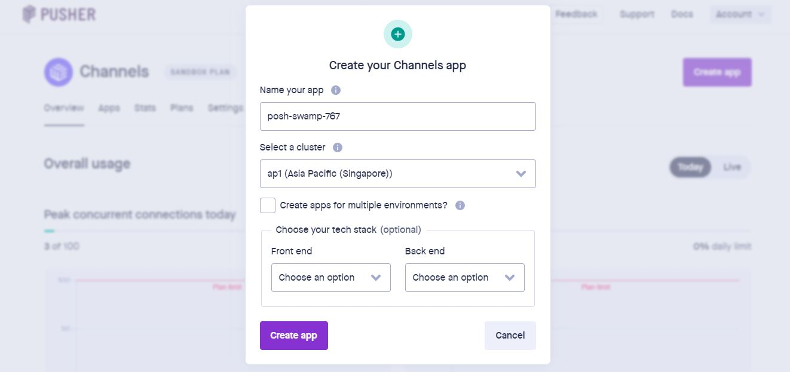

<h1 align="center"> Whatsapp MERN 🔥 </h1>

<p align="center"> 
    </img>
</p>

<p align="center">
  <a href="https://nodejs.org/en/blog/release/v12.13.0/"></a>
  <a href="https://reactjs.org/"></a>
  <a href="https://www.npmjs.com/package/npm/v/6.13.4"></a>
  <a href="https://expressjs.com/"></a>
  <a href="https://pusher.com/"></a>
</p>

## Clone dan Gunakan 📋

- Clone ke sistem lokal Anda menggunakan perintah di bawah ini:

```python
    git clone https://github.com/akhfasarrofi/whatsapp-mern.git
    git clone https://github.com/akhfasarrofi/whatsapp-mern-backend.git
```

- Jalankan perintah berikut di direktori ```whatsapp-mern``` untuk menambahkan dependensi:
```python
    npm install
```

## Buat database di **[monggodb](https://docs.mongodb.com/manual/tutorial/getting-started/)**

<p align="center"> 
    </img>
</p>

- Setelah anda membuat akun di monggodb, anda akan melihat menu `Clusters` dan pilih `connect`

- Buka file `server.js` di folder `whatsapp-mern-backend`, dan anda akan menemukan code seperti dibawah ini:

```javascript
/* DB Config */
const connection_url = "KONEKSI MONGGODB ANDA"
```
Copy koneksi anda sendiri dan jangan lupa ganti `<password>` dan `<dbname>` nya.

## Buat akun di **[pusher](https://pusher.com/)**

- Pilih `Create app` lalu isikan bagian frontend dengan ```reactjs``` dan backend ```nodejs```
<p align="center"> 
    </img>
</p>
- Copy API di Step 1 dan tempelkan pada file ````App.js``` yang ada di foler ```whatsap-mern```
```javascript
/* konek ke pusher api */
  useEffect(() => {
    const pusher = new Pusher('API anda', {
      cluster: 'ap1'
    });
```

- Scrol ke bawah sampai menemukan step 2 dan lalukan hal yang sama seperti langkah sebelumnya
```javascript
/* connect to pusher */
const pusher = new Pusher({
    /* PASTEKAN DISINI */
});
```

- Jalankan perintah `nodemon` untuk menjalankan servernya di folder `whatsapp-mern-backend` dan jalankan `npm start` di folede `whatsapp-mern`

